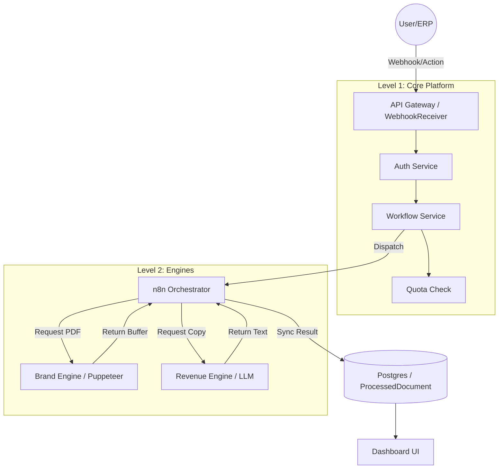

# Floovioo System Architecture

> **Note**: For detailed technical specifications, database schemas, and API reference, please see [TECHNICAL_SPEC.md](./TECHNICAL_SPEC.md).

## 1. The "Branded House" Vision
Floovioo is a multi-product Enterprise Platform designed to unify business automation under one brand identity.

### The 4 Pillars
*   **Transactional**: Financial document automation (Invoices, Quotes).
*   **Sales**: Proposal generation and deal rooms.
*   **Content**: Marketing asset creation.
*   **Retention**: Dunning and support automation.

---

## 2. Core Patterns

### 2.1 Modular Monolith
The system is built as a single Express.js application (`src/app.ts`) but logical components are separated by "Services" (`src/services/`). 
*   **Shared Core**: Auth, Billing, Logging, Integration.
*   **Feature Modules**: Each product pillar is a set of Services + Routes.

### 2.2 Filter-Dispatch-Sync (The "Brain")
We do not hardcode complex business logic in Node.js. Instead, we use a delegation pattern:

1.  **Filter (Node.js)**:
    *   Ingests signals (`webhook.service.ts`).
    *   Checks Entitlements (`quota.service.ts`, `subscription.service.ts`).
    *   Loads Context (`Business`, `App`).
2.  **Dispatch (n8n)**:
    *   Sends a standardized "Envelope" to n8n Webhooks.
    *   n8n executes the logic (e.g., "If Amount > $1k, add 'VIP' sticker").
3.  **Sync (Node.js)**:
    *   n8n calls back to `/api/internal/*` with results.
    *   Node.js creates the final immutable record (`ProcessedDocument`).

---

## 3. Data Flow Diagram

## 4. Key Infrastructure
*   **App**: Node.js v18 (Express + TypeScript).
*   **Queue**: BullMQ (Redis) for async PDF generation and heavy jobs.
*   **Database**: PostgreSQL (Prisma ORM).
*   **Browser**: Puppeteer (Headless Chrome) for rendering.
