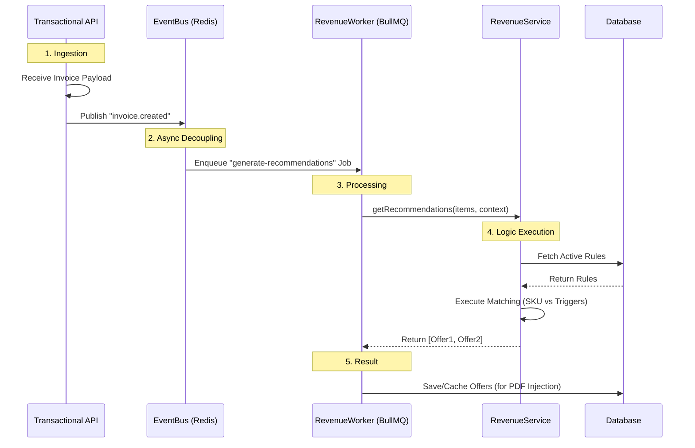

# Floovioo Revenue Engine: End-to-End Walkthrough

This document explains how the **V2 Revenue Engine** components interact to turn a standard invoice into a revenue-generating asset.

## 1. The High-Level Flow (Mermaid)

## 2. Component Deep Dive

### A. The "Nervous System" (EventBus)
*   **File**: `src/modules/transactional/events/event.bus.ts`
*   **Role**: Decouples the API from the heavy lifting. The API responds fast (200 OK), while the engine works in the background.
*   **Technology**: Redis Pub/Sub.

### B. The "Muscle" (RevenueWorker)
*   **File**: `src/modules/transactional/workers/revenue.worker.ts`
*   **Role**: Handles background tasks. It listens to the queue and executes jobs so the main web server doesn't freeze.
*   **Technology**: BullMQ (Redis-based Queue).

### C. The "Brain" (RevenueService)
*   **File**: `src/modules/transactional/revenue/revenue.service.ts`
*   **Role**: Contains the business logic.
    1.  **Fetches Rules**: specific to the Tenant (`businessId`).
    2.  **Matches Triggers**: Does this invoice contain `BASIC-PLAN`?
    3.  **Generates Offers**: "Upgrade to Premium for $99".

### D. The Data (Prisma Schema)
*   **Models**:
    *   `RecommendationRule`: The logic (If X -> Suggest Y).
    *   `Campaign`: Time-based overrides (Black Friday Promo).

## 3. How to Verify It Works
We created a script that mimics this entire flow without needing the frontend:
`src/modules/transactional/scripts/verify-revenue-engine.ts`

1.  It creates a dummy **Business** and **Product**.
2.  It creates a **RecommendationRule** ("If Basic -> Upsell Premium").
3.  It calls the **RevenueService** with a dummy invoice containing "Basic".
4.  It asserts that the Service returns the "Premium" offer.

## 4. Next Step: Wiring the API
Currently, the components exist, but `TransactionalController` needs to call `EventBus.publish()`.
**Coming Up**: We will update `src/controllers/transactional.controller.ts` to emit the event.
