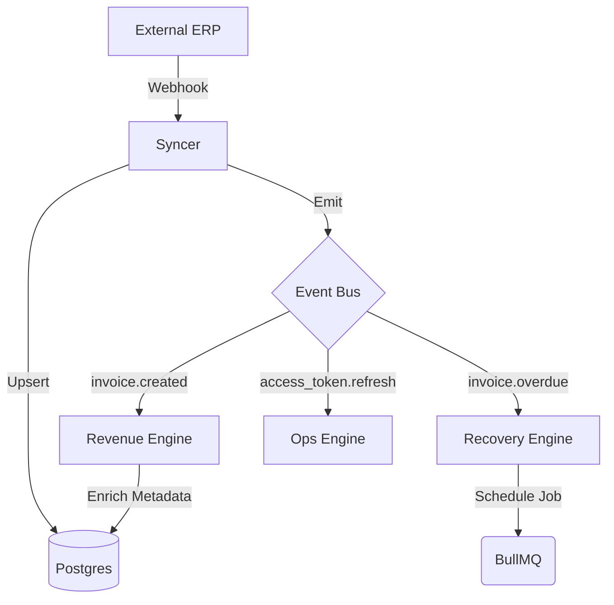

# Floovioo Enterprise Architecture: V2 Specification
*Status: DRAFT | Version: 2.1 | Scope: Floovioo Transactional (Flagship Product)*

## 1. Vision: The Branded House
**Floovioo** is the Enterprise Platform. It hosts a suite of specialized products:
*   **Floovioo Transactional** (Current Flagship): Automates and monetizes financial documents.
*   *Floovioo Sales* (Future).
*   *Floovioo CRM* (Future).

### The "Transactional" Product Vision
Within the **Floovioo Transactional** product, we are shifting the paradigm from **"Cost Center"** to **"Profit Center"**.
The "Revenue Engine" and "Recovery Engine" specified here are core features of the **Transactional** product, leveraging the shared Enterprise Platform data.

---

## 2. System Architecture (Platform vs Product)

### Level 1: The Floovioo Platform (Shared Core)
*   **Identity**: Users, Businesses, Permissions.
*   **Connectivity**: `IntegrationConfig` (Zoho/QBO), `Contact` Sync, `Product` Sync.
*   **Billing**: Subscription management for the Floovioo service itself.

### Level 2: The Transactional Product (The Engines)
*   **Brand Engine**: The renderer (HTML -> PDF).
*   **Revenue Engine**: The AI upsell logic (injects offers into PDFs).
*   **Recovery Engine**: The dunning system (sends follow-up emails).
*   **Intelligence Engine**: Reporting specific to Transactional performance.

---

## 3. Domain Models (Rich OOAD)

### 3.1 Domain: Commerce & Revenue (`RevenueEngine`)
*The Brain that turns transactions into growth.*

| Entity | Type | Description |
| :--- | :--- | :--- |
| **Product** | Entity | Synced from ERP. Enhanced with `tags`, `category`. |
| **RecommendationRule** | Entity | Logic for pairing. `TriggerSKU` -> `TargetSKU`. |
| **Campaign** | Entity | Seasonal overrides. "Black Friday: Promote SKU-99 on all Invoices". |
| **Offer** | Value Object | The generated suggestion. Contains `copy` (AI), `discount_code`. |

**Process Flow: The "Smart Upsell"**
1.  `RevenueEngine` receives `invoice.created` event.
2.  Analyzes `InvoiceLines`.
3.  **Matching Algorithm**:
    *   *Rule-Based*: Matches `RecommendationRule` (e.g., Laptop -> Bag).
    *   *AI-Based*: If no rule, prompts LLM: "Customer bought [Item]. We have [Inventory]. Suggest 1 relevant item with 'Friendly' tone."
4.  Resulting `Offer` is saved to `Invoice.metadata`.
5.  **Brand Engine** renders PDF, checking `metadata.upsells`.

### 3.2 Domain: Retention & Recovery (`RecoveryEngine`)
*The "Nurturing Collector".*

| Entity | Type | Description |
| :--- | :--- | :--- |
| **DunningSequence** | Entity | Config for a Tenant. "Day 1: Gentle, Day 7: Firm". |
| **DunningAction** | Entity | Log of actions (emails/SMS). |
| **PayLink** | Value Object | Smart link embedded in PDF. Tracks clicks + Auto-logs in. |

**Process Flow: The "Empathic Nudge"**
1.  `RecoveryEngine` listens for `invoice.overdue`.
2.  Checks `DunningSequence` for `Day: 1`.
3.  **AI Generation**:
    *   Context: `Customer.LTV` (High LTV = Softer tone).
    *   Prompt: "Write a polite reminder for [Invoice]. Use 'Helpful' voice. Don't sound automated."
4.  Delivers Email.

### 3.3 Domain: Intelligence (`BiEngine`)
*The "Executive Advisor".*

| Entity | Type | Description |
| :--- | :--- | :--- |
| **ReportSchedule** | Entity | "Send Weekly Summary to [CEO Email]". |
| **Metric** | Entity | "UpsellConversionRate", "DunningRecoveryRate". |

---

## 4. API Specification (V2 Additions)

### POST `/api/v2/revenue/recommendations/preview`
*Simulates the "Smart Upsell" logic without booking an invoice.*
*   **Input**: `{ "items": ["sku_123"] }`
*   **Output**: `{ "recommendations": [{ "sku": "sku_999", "reason": "Often bought together", "copy": "Don't forget the charger!" }] }`

### POST `/api/v2/recovery/dunning/simulate`
*Generates the email copy that WOULD be sent for a given invoice state.*
*   **Input**: `{ "invoiceId": "...", "daysOverdue": 7 }`
*   **Output**: `{ "subject": "Friendly reminder...", "body_html": "..." }`

---

## 5. Scalability & Edge Cases

### Edge Case: The "Infinite Loop" Sync
*   **Risk**: ERP Webhook -> Update Local -> Trigger n8n update -> Update ERP -> Trigger Webhook...
*   **Solution**: `SourceOfTruth` header in updates. If update comes from "Floovioo", ERP webhooks are ignored.

### Edge Case: AI Hallucination in Finance
*   **Risk**: AI writes "We waived the fee" in the Dunning email.
*   **Solution**: **Strict Mode Prompts**. AI only generates *flavor text*, not *facts*.

### Scalability Strategy
*   **Read-Heavy**: Revenue recommendations must be instant ( < 200ms).
*   **Architecture**: `Product` and `RecommendationRule` data is hot-loaded into Redis (`Hash` structures). The `RevenueEngine` reads from Redis, not Postgres.
